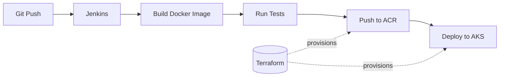

# DevOps CI/CD Pipeline — Docker · Terraform · Kubernetes · Jenkins · Azure

An end-to-end DevOps project that takes a containerized Node.js app from source code to a live deployment on **Azure Kubernetes Service (AKS)**, fully automated through a **Jenkins** pipeline. Infrastructure is provisioned as code with **Terraform**, and images are stored in **Azure Container Registry (ACR)**.

One push triggers a pipeline that builds, tests, pushes, and deploys the application — no manual steps.

---

## Architecture



The application code is packaged by Docker, the cloud infrastructure (ACR + AKS) is built by Terraform, Jenkins orchestrates the pipeline, and Kubernetes runs the workload with self-healing and a public LoadBalancer endpoint.

---

## Tech Stack

| Layer | Tool |
|---|---|
| Application | Node.js + Express |
| Containerization | Docker |
| Image Registry | Azure Container Registry (ACR) |
| Infrastructure as Code | Terraform |
| Orchestration | Kubernetes (Azure AKS) |
| CI/CD | Jenkins (self-hosted, containerized) |
| Cloud | Microsoft Azure (region: South India) |

---

## How the Pipeline Works

The `Jenkinsfile` defines six stages, each automating a step that would otherwise be run by hand:

| Stage | What it does |
|---|---|
| Checkout | Clones the repository |
| Build | Builds the Docker image, tagged with the Jenkins build number for immutability |
| Test | Runs the test suite inside the freshly built container |
| Azure Login | Authenticates to Azure as a Service Principal (no stored passwords in code) |
| Push | Pushes the tagged image to ACR |
| Deploy | Performs a rolling update on the AKS deployment |

Secrets (Service Principal credentials) are stored in Jenkins' encrypted credential store and injected at runtime — they never appear in source control or build logs.

---

## Project Structure

```
.
├── Dockerfile            # Application image (Alpine-based, layer-cache optimized)
├── Jenkinsfile           # CI/CD pipeline definition
├── server.js             # Express app (/ and /health endpoints)
├── test.js               # Simple endpoint test for the pipeline
├── package.json
├── .gitignore            # Excludes Terraform state, node_modules, etc.
├── jenkins/
│   └── Dockerfile        # Custom Jenkins image (Docker CLI + Azure CLI + kubectl)
├── k8s/
│   ├── deployment.yaml   # 2 replicas, liveness probe, ACR image
│   └── service.yaml      # LoadBalancer service (public IP)
└── terraform/
    ├── provider.tf
    ├── variables.tf
    ├── main.tf           # Resource Group + ACR + AKS + AcrPull role assignment
    └── output.tf
```

---

## Running It Yourself

### 1. Provision infrastructure (Terraform)
```bash
az login
cd terraform
terraform init
terraform apply
```
This creates the Resource Group, ACR, and AKS cluster, and grants AKS permission to pull from ACR via a managed identity.

### 2. Connect to the cluster
```bash
az aks get-credentials --resource-group <rg-name> --name <aks-name>
kubectl get nodes
```

### 3. Set up Jenkins
Build and run the custom Jenkins image (includes Docker CLI, Azure CLI, kubectl):
```bash
docker build -t jenkins-devops ./jenkins
docker run -d --name jenkins \
  -p 8080:8080 -p 50000:50000 \
  -v jenkins_home:/var/jenkins_home \
  -v //var/run/docker.sock:/var/run/docker.sock \
  jenkins-devops
```
Add the Azure Service Principal credentials (`azure-client-id`, `azure-client-secret`, `azure-tenant-id`) to Jenkins as Secret Text, point a Pipeline job at this repo, and run it.

### 4. Tear down (stop billing)
```bash
cd terraform
terraform destroy
```

---

## Engineering Decisions & Problems Solved

A big part of this project was diagnosing and fixing real issues — not just following a happy path:

- **Managed identity over stored passwords.** AKS pulls from ACR using a system-assigned managed identity with the `AcrPull` role, instead of embedding registry credentials in the cluster. The same principle applies to the Jenkins → Azure auth via Service Principal.
- **VM size region restriction.** The initial `Standard_B2s` node size wasn't available in the subscription's region; diagnosed from the Azure error and switched to the allowed `Standard_B2s_v2`.
- **Docker socket permissions.** Jenkins (running as a non-root user inside a container) was denied access to the mounted Docker socket; resolved by adjusting socket permissions, with the production-correct approach (group/GID) noted.
- **Windows → Linux case sensitivity.** `dockerfile` / `jenkinsfile` worked locally on case-insensitive Windows but broke on the case-sensitive Linux CI environment; fixed by adopting the conventional `Dockerfile` / `Jenkinsfile` casing.
- **Immutable image tags.** Images are tagged with the build number (not `latest`) and pulled with `imagePullPolicy: Always` to avoid stale-image caching on redeploys.
- **No secrets in version control.** Terraform state and dependencies are git-ignored; Service Principal secrets live only in Jenkins' encrypted store.

---

## Possible Improvements

- Move infrastructure identifiers (subscription ID) and config out of the `Jenkinsfile` into Jenkins parameters/credentials.
- Add an Ingress controller instead of a per-app LoadBalancer for multi-service routing.
- Replace Service Principal auth with OIDC / workload identity federation (no long-lived secret).
- Add automated rollback on failed health checks and a staging environment with manual approval gates.

---

## Author

**Imalka Perera**
GitHub: [@imalkaperera13](https://github.com/imalkaperera13)
